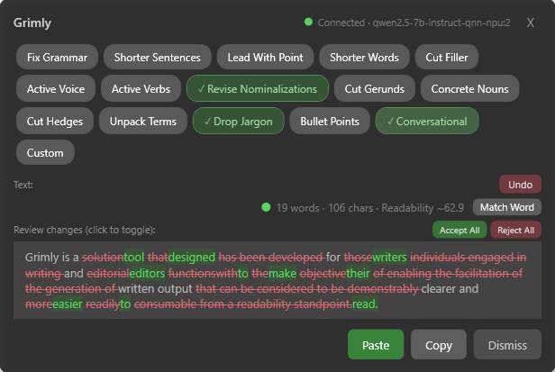

# Grimly

**AI-powered readability editing that runs entirely on your machine.**

Grimly helps you make your writing clearer and easier to read. Select text in any app, hit a hotkey, and get instant readability scoring, typo flagging, and targeted AI rewrites — all powered by a local language model. Your copy never leaves your computer.

## Why Grimly?

Readability is one of the hardest parts of writing well. Most tools focus on grammar. Grimly focuses on clarity.

You pick the technique — shorter sentences, active voice, cut filler, drop jargon, revise nominalizations, lead with the point — and Grimly applies it. You see exactly how each change affects your Flesch Reading Ease score before you accept it.

Because Grimly runs a local LLM on your machine, there are no usage limits, no API keys, and no privacy concerns. Write about confidential products, unreleased strategies, or client work without sending a word to a third-party server.

## How it works

1. **Select text** in any app.
2. **Activate Grimly** with a hotkey or the floating icon.
3. **See your baseline** — Flesch Reading Ease score, word count, character count, and inline typo highlighting.
4. **Pick a technique** — choose from 16 targeted writing moves like Shorter Sentences, Active Voice, Cut Hedges, Concrete Nouns, Unpack Terms, Drop Jargon, Conversational, or Custom.
5. **Review the rewrite** — Grimly shows the improved text and the updated readability score side by side.
6. **Paste, copy, or dismiss** — one click puts the revised text back where it came from.

Want a second opinion? **Match Word** runs your text through Microsoft Word's readability calculator, which scores things a bit differently.

## Getting started

### Installation

Download the latest release for your platform from the [Releases page](../../releases/latest):

- **Windows (x64)** — `grimly-win-x64.zip`
- **Windows (ARM64)** — `grimly-win-arm64.zip`
- **macOS** — `grimly-macos.zip`

### First run

The first time you launch Grimly, it automatically downloads and configures [Microsoft Foundry Local](https://github.com/microsoft/foundry) and loads a default model appropriate for your hardware. No manual setup required.

On ARM64 devices with a Qualcomm Neural Processing Unit, Grimly runs on the NPU by default for faster inference and lower battery draw.

### Advanced: choose your own model

If you're already running Foundry Local, you can point Grimly at any available model through **Settings > Model**.

## The 16 techniques

| Technique | What it does |
|---|---|
| Fix Grammar | Corrects grammar, spelling, and punctuation |
| Shorter Sentences | Breaks long sentences into shorter ones |
| Lead With Point | Moves the main idea to the front of each sentence |
| Shorter Words | Replaces complex words with simpler alternatives |
| Cut Filler | Removes unnecessary words and phrases |
| Active Voice | Converts passive constructions to active voice |
| Active Verbs | Replaces weak verbs and nominalizations with stronger verbs |
| Revise Nominalizations | Turns noun forms back into their verb equivalents |
| Cut Gerunds | Reduces overuse of -ing constructions |
| Concrete Nouns | Replaces vague nouns with specific, concrete ones |
| Cut Hedges | Removes hedging language (might, perhaps, somewhat) |
| Unpack Terms | Expands acronyms and technical shorthand |
| Drop Jargon | Replaces jargon with plain-language equivalents |
| Bullet Points | Restructures dense text into bulleted lists |
| Conversational | Rewrites in a more natural, spoken tone |
| Custom | Apply your own editing instruction |

## Built with

- [Microsoft Foundry Local](https://github.com/microsoft/foundry) — local LLM runtime
- Flesch Reading Ease scoring engine

## Why I built this

I lead a content team and edit a lot of technical copy — blog posts, white papers, reports, and a weekly cybersecurity podcast. Readability is the thing I push on hardest and the thing that's hardest to teach. I wanted a tool that could apply specific writing techniques on demand, show the readability impact in real time, and do it all without sending sensitive pre-publication copy to a cloud API. Nothing I found did all three, so I built it.

## Contributing

Contributions are welcome. See [CONTRIBUTING.md](CONTRIBUTING.md) for guidelines.

## License

[MIT](LICENSE)
